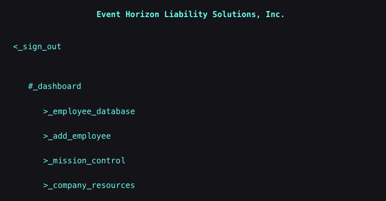
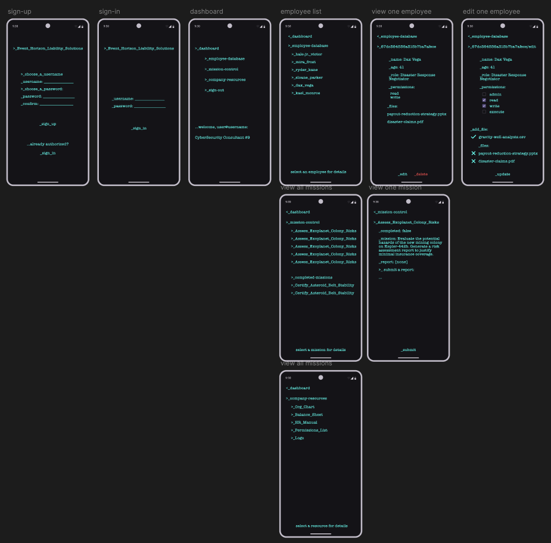

# Event Horizon Liability Solutions

## GitHub repository links:
[front end](https://github.com/radford-coding/project-3-front-end-Event-Horizon-Liability-Solutions.git)

[back end](https://github.com/seradelarosa/EHLS-project-backend.git)

## Trello link:
[planning board](https://trello.com/b/67IfCuDU/project-3-mern-stack-crud-cyberpunk-hacking-game)

## Deployed app:
[front end](https://event-horizon-liability-solutions.netlify.app/)

[back end](https://event-horizon-liability-sol-6685ee1960ca.herokuapp.com)

## Project Explanation:
"Congratulations on your induction into EHLS. As our newest cybersecurity operative, your expertise is critical to safeguarding our network's integrity."
We decided to take our CRUD app to the next level, and have CRUD operations comprise the gameplay in this futuristic world. After signing up, the user is taken to the dashboard of their cybersecurity terminal, with access to a database of users on which they have CRUD privileges, a form for creating a new employee entry, a list of missions, and some (un)helpful company resources. The missions assigned to the player take them through various CRUD operations as they clean up the database: updating employee permissions, removing suspect files, handing out a promotion, and removing an imposter. After completing all the missions, their services are appreciated!

## RESTful Route definitions

| HTTP Method              | controller | Response | URI | Use Case |
| :----------------:       | :------:    | :----:  | :---- | :---- |
| POST        |   auth   | 201 |  /auth/sign-up |  register and create a new user  |
| POST        |   auth   | 200 |  /auth/sign-in |  log in  |
| GET | users | 200 | /users | get all users |
| GET | users | 200 | /users/:userId | get a user's details |
| GET | users | 200 | /users/:userId/employees | get index of employees |
| POST | users | 201 | /users/:userId/employees | create new employee |
| GET | users | 200 | /users/:userId/employees/:employeeId | get one employee's details |
| PUT | users | 200 | /users/:userId/employees/:employeeId | edit an employee's data |
| DELETE | users | 200 | /users/:userId/employees/:employeeId | delete an employee |
| GET | users | 200 | /users/:userId/missions/ | get index of missions |
| GET | users | 200 | /users/:userId/missions/:missionId | get one mission's details |
| PUT | users | 200 | /users/:userId/missions/:missionId | edit a mission |

------

## Technologies Used:
* Front end: 
    * React: For the development of the user interface and navigation in a SPA (Single Page Application). Included are Context API and React Router.
    * Figma: For designing the different pages in the app. Wireframes included below.
    * Lighthouse in Chrome DevTools for checking speed and accessibility.
    * Of course, HTML/CSS/JS.

* Back End:
    * Node.js and Express: For the server and the RESTful API.
    * MongoDB and Mongoose: For data storage and management of users, employees and missions.
    * JSON Web Tokens (JWT): For session authentication.

## Figma wireframes

## Possible future improvements: 
1.	 Roles and Permissions System: Implement specific roles (administrator, manager, employee) to differentiate access levels and available functionalities.
2.	 Statistics and Progress: Add graphics and statistics on mission performance and player progress.
3.	 Real-Time Chat: Include a communication system to coordinate strategies between players.
4.	 Real-Time Notifications: Use WebSockets to show instant updates of mission changes or security alerts.
5.	 User Interface Improvements, including animations and transitions for a more engaging visual experience.
6.	 Integration of an Achievement System: Rewards and achievements when completing missions or managing employees efficiently.
7.	 Multiplayer Mode: Ability to collaborate or compete with other players in shared cybersecurity tasks.
8.  Port the app to React Native (discussed below)

## Feasibility of portability to React Native

* Porting the application to React Native is feasible, since component logic and state management in React can be easily moved. However, some challenges include:

* Navigation: Instead of using React Router, React Navigation would be used.

* User Interface: Interface components such as buttons and forms must be adapted to the mobile environment using native components such as View, Text, and TouchableOpacity.

* Local Storage: Local storage on mobile devices is typically handled with libraries such as AsyncStorage.

* API services: Communication with the backend can still be through `fetch`, but adjustments in the management of routes may be required.

# Technical Requirements

| MVP Requirements                                                                                                           | Complete?|
|---------------------------------------------------------------------------------------------------------------------------------------|----------|
| The back-end application is built with Express and Node.                                                                              | Complete |
| The front-end application is built with React.                                                                                        | Complete |
| MongoDB is used as the database management system.                                                                                    | Complete |
| The back-end and front-end applications implement JWT token-based authentication to sign up, sign in, and sign out users.             | Complete |
| Authorization is implemented across the front-end and back-end. Guest users (not signed in) should not create, update, or delete data.| Complete |
| The project has at least two data entities besides the User model, with at least one having a relationship with the User model.       | Complete |
| The project has full CRUD functionality on both the back-end and front-end.                                                           | Complete |
| The front-end application does not hold secret keys. Public APIs requiring secret keys must be accessed from the back-end.            | Complete |
| The project is deployed online so that the rest of the world can use it.                                                              | Complete |

| Code Convention Requirements                                                                                                          | Complete?|
|---------------------------------------------------------------------------------------------------------------------------------------|----------|
| Files in the back-end and front-end are organized according to conventions demonstrated in lectures.                                  | Complete |
| Code in the back-end and front-end adheres to coding conventions demonstrated in lectures, like using plural names for arrays.        | Complete |
| No dead code, commented-out sections, or console logs in the back-end and front-end applications.                                     | Complete |
| The back-end application runs without errors in the terminal.                                                                         | Complete |
| The front-end application runs without errors in the browser's console.                                                               | Complete |
| The back-end application follows RESTful routing conventions for routes.                                                              | Complete |
| The back-end and front-end applications are coded using proper indentation.                                                           | Complete |

| UI/UX Requirements                                                                                                                    | Complete?|
|---------------------------------------------------------------------------------------------------------------------------------------|----------|
| The application has a visual theme, including a consistent color palette and cohesive layout across pages.                            | Complete |
| The application is easily navigable by a first-time user.                                                                             | Complete |
| The application uses CSS Flexbox and/or Grid for page layout.                                                                         | Complete |
| Colors used in the app meet the WCAG 2.0 level AA standard for contrast.                                                              | Complete |
| When editing an item, the form is pre-filled with that item's details.                                                                | Complete |
| Only the creator of a piece of data can see and interact with the UI for editing or deleting that data.                               | Complete |
| All images have alt text.                                                                                                             | n/a |
| No text is placed on top of images in a way that makes the text inaccessible.                                                         | n/a |
| All buttons are styled.                                                                                                               | Complete |

| Git and GitHub Requirements                                                                                                           | Complete?|
|---------------------------------------------------------------------------------------------------------------------------------------|----------|
| All your group memebrs are shown as contributors to the project on GitHub.                                                                        | Complete |
| GitHub repositories are appropriately named and publicly accessible.                                                                  | Complete |
| Commit history dates back to the beginning of the project, and old repos are preserved if starting over.                              | Complete |
| Commit messages are descriptive of the work done in each commit.                                                                      | Complete |

| README Requirements                                                                                                                   | Complete?|
|---------------------------------------------------------------------------------------------------------------------------------------|----------|
| Screenshot/Logo: A screenshot of the app or a logo is included.                                                                       | Complete |
| App name and description: Include a description of your app and its functionality.                                                    | Complete |
| Getting started: Link to deployed app, planning materials, and back-end repository.                                                   | Complete |
| Attributions: Links to any external resources requiring attribution.                                                                  | Complete |
| Technologies used: List of principal technologies used in the application.                                                            | Complete |
| Next steps: Planned future enhancements (stretch goals).                                                                              | Complete |
| Back-end README: Contains the project name and a link to the front-end repository on GitHub.                                          | Complete |

| Presentation Requirements                                                                                                             | Complete?|
|---------------------------------------------------------------------------------------------------------------------------------------|----------|
| Present your project in front of the class on the scheduled presentation day.                                                         | Complete |
| Present the project that was approved by your instructor.                                                                             | Complete |

| Summary                                                                                                                               | Complete?|
|---------------------------------------------------------------------------------------------------------------------------------------|----------|
| Project meets minimum requirements and passes.                                                                                        | Complete |